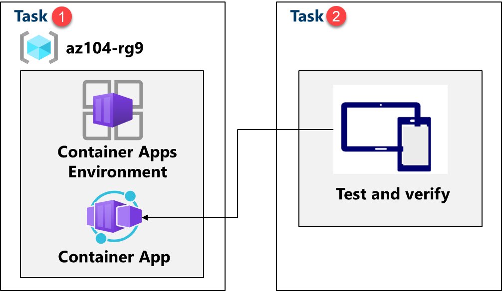
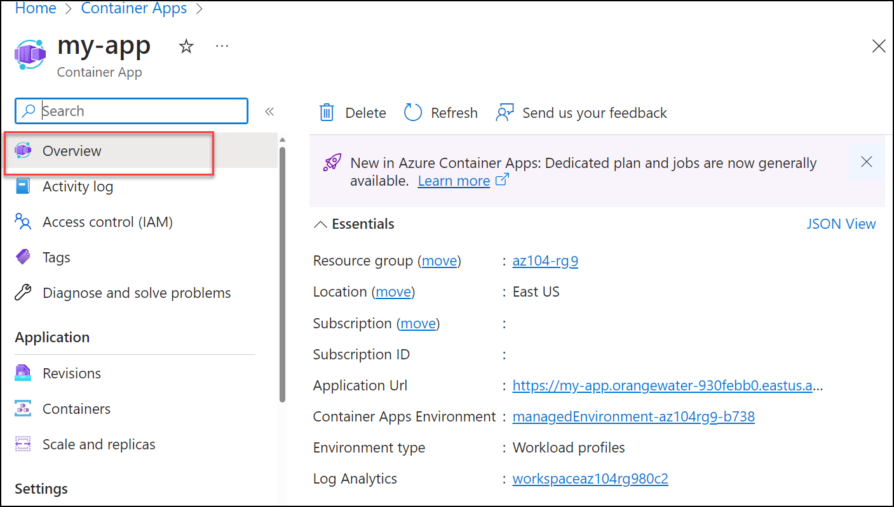

---
Lab:
    Title: 'Lab 09c: Implement Azure Container Apps'
    Module: 'Administer PaaS Compute Options'
---

# Lab - Implement Azure Container Apps
---
## Lab Introduction

In this lab, you learn how to implement and deploy Azure Container Apps.

This lab requires an Azure subscription. Your subscription type may affect the availability of features in this lab. You may change the region, but the steps are written using **East US**.

## Estimated Timing: 15 Minutes

## Lab Scenario

**Adamantus Technologies** has a web application that runs on a virtual machine in your on-premises data center. The organization wants to move all applications to the cloud but doesn't want to have a large number of servers to manage. You decide to evaluate Azure Container Apps.

## Architecture Diagram

## Job Skills

- **Task 1: Create and configure an Azure Container App and environment.**
- **Task 2: Test and verify deployment of the Azure Container App.**

## Task 1: Create and Configure an Azure Container App and Environment

Azure Container Apps take the concept of a managed Kubernetes cluster a step further and manages the cluster environment as well as provides other managed services on top of the cluster. Unlike an Azure Kubernetes cluster, where you must still manage the cluster, an Azure Container Apps instance removes some of the complexity to setting up a Kubernetes cluster.

1. From the Azure portal, search for and select `Container Apps`.

1. Select **+ Create**, from drop-down menu, **Container App**. Notice the other choices. 

1. Use the following information to fill out the details on the **Basics** tab.*.

    | Setting | Action |
    |---|---|
    | Subscription | Select your Azure subscription |
    | Resource group | `az104-rg9` |
    | Container app name |  `my-app` |
    | Region    | **East US** (|
    | Container Apps Environment | Select **Create new** > Set Environment name to `my-environment` > **Create** |

1. Click **Next: Container** tab and ensure that **Use quickstart image** is checked. You may need to scroll up to view this setting. 

1. Ensure **Quickstart image** is set to **Simple hello world container**. Notice the other choices. 

1. Select the **Review and create** and then **Create**.

    >**Note:** Wait for the container app to deploy. This will take a couple of minutes. 
 
## Task 2: Test and Verify Deployment of the Azure Container App

By default, the Azure container app that you create will accept traffic on port 80 using the sample Hello World application. Azure Container Apps will provide a DNS name for the application. Copy and navigate to this URL to ensure that the application is up and running.

1. Select **Go to resource** to view your new container app.

1. Select the link next to *Application URL* to view your application.

    

1. Verify you receive the **Your Azure Container Apps app is live** message.
   
## Cleanup your Resources

If you are working with **your own subscription** take a minute to delete the lab resources. This will ensure resources are freed up and cost is minimized. The easiest way to delete the lab resources is to delete the lab resource group. 

+ In the Azure portal, select the resource group, select **Delete the resource group**, **Enter resource group name**, and then click **Delete**.
+ Using Azure PowerShell, `Remove-AzResourceGroup -Name resourceGroupName`.
+ Using the CLI, `az group delete --name resourceGroupName`.

## Key Takeaways

Congratulations on completing the lab. Here are the main takeaways for this lab. 

+ Azure Container Apps (ACA) is a serverless platform that allows you to maintain less infrastructure and save costs while running containerized applications.
+ Container Apps provides server configuration, container orchestration, and deployment details. 
+ Workloads on ACA are usually long-running processes like a Web App.
---

  
  

  
<strong>Ceekh Edunix Pvt Ltd</strong>
 
    Address: H-34, Ground Floor, Sector 63, Noida, Uttar Pradesh 
    Email: <a href="mailto:info@ceekh.com" style="color: #007bff;">info@ceekh.com</a>
  

  

© 2025 EduWe. All rights reserved.| Developed by Deepak Kumar Tyagi 

 
