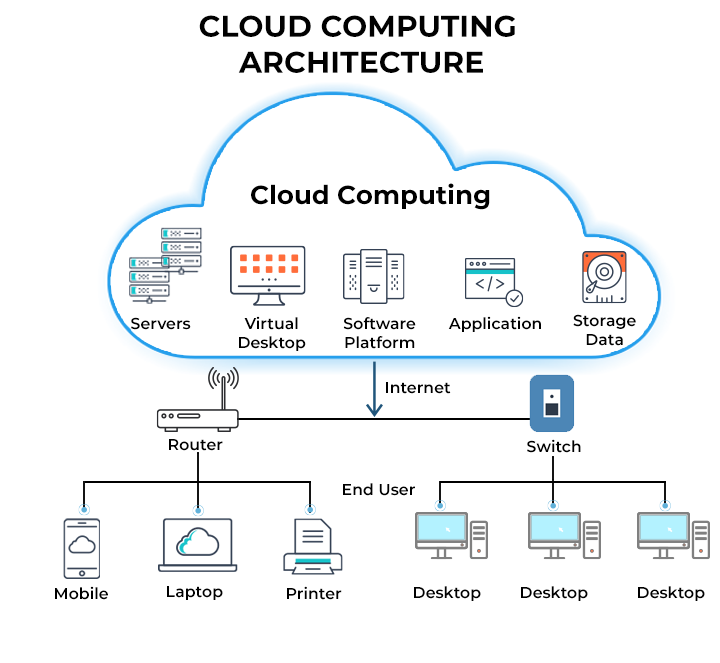

# 🌥️ **Cloud Computing: The Backbone of Modern IT Education**

In today’s digital-first world, computing is no longer confined to bulky desktops or university labs. It has moved into an invisible yet omnipresent realm—the **cloud**. For academic institutions, particularly those focused on computer science, IT, business, or engineering, **Cloud Computing** is not just a buzzword—it's an essential component of modern curriculum and research.

This blog aims to give a comprehensive overview of Cloud Computing in the context of an academic course, highlighting key concepts, service models, deployment strategies, and practical use cases relevant for students and educators alike.

---

## 📚 What is Cloud Computing?

Cloud Computing refers to the **on-demand delivery of computing services**—including servers, storage, databases, networking, software, analytics, and intelligence—over the internet. These resources are accessed remotely, eliminating the need for physical infrastructure ownership.

> In academic terms, Cloud Computing is a model that enables **ubiquitous, convenient, on-demand network access** to a shared pool of configurable computing resources.

---

## 🏛️ Why Teach Cloud Computing in Academia?

### ✦ Relevance to Modern Industry  
Industries today—from startups to Fortune 500 companies—rely on cloud platforms like **Microsoft Azure**, **Amazon Web Services (AWS)**, and **Google Cloud Platform (GCP)**. Educating students in these technologies bridges the gap between classroom learning and job market expectations.

### ✦ Support for Online Learning  
Cloud-based platforms such as **Google Classroom**, **Moodle**, and **Microsoft Teams** have become standard in education delivery—especially post-pandemic.

### ✦ Enables Research & Innovation  
Access to virtual machines, data lakes, and cloud AI services empower students to run simulations, process large datasets, and build scalable prototypes—all without expensive hardware.

---
## 🔍 Benefits of Cloud Computing 

## 🔍 Core Concepts Covered in a Cloud Computing Course

An academic course typically explores the following foundational topics:

### 1. **Cloud Deployment Models**

| Model         | Description                                           | Example Use Case                     |
|---------------|-------------------------------------------------------|--------------------------------------|
| Public Cloud  | Services delivered over the internet by providers     | Hosting student websites on AWS      |
| Private Cloud | Dedicated cloud infrastructure for one institution    | University-managed internal LMS      |
| Hybrid Cloud  | A mix of public and private cloud solutions           | University data stored locally, website on cloud |

### 2. **Cloud Service Models**

#### A. **Infrastructure as a Service (IaaS)**  
Provides virtual machines, storage, and networks.  
🖥️ *Example: Hosting a virtual lab environment for student experiments.*

#### B. **Platform as a Service (PaaS)**  
Gives students tools to develop, test, and deploy apps.  
🛠️ *Example: Deploying Python/Java apps via Google App Engine.*

#### C. **Software as a Service (SaaS)**  
Delivers ready-to-use software over the web.  
📧 *Example: Using Microsoft 365 for assignments and communication.*

---

## 🧑‍💻 Classroom to Cloud: A Real-World Scenario

**Case Study: Adamantus Technologies' Academic Portal**

Adamantus Technologies, a tech-focused institution, built a cloud-native portal for students and faculty. Hosted on **Azure Cloud**, it integrates:

- **SaaS**: Microsoft Teams and Office 365  
- **PaaS**: Azure App Service for custom academic tools  
- **IaaS**: Virtual machines for student labs  
- **AI & Analytics**: Power BI dashboards for student performance

**Result**: Students access labs remotely, submit projects online, and even train machine learning models—all securely and cost-effectively.

---

## 🔐 Cloud Security in Education

Security remains a priority, especially for institutions handling sensitive student data.

**Key Concepts:**
- **Data Encryption** (in transit and at rest)  
- **Multi-Factor Authentication (MFA)**  
- **Role-Based Access Control (RBAC)**  
- **Compliance** with GDPR, FERPA, and other education-specific regulations

---

## 🧪 Lab Activities to Reinforce Learning

Hands-on labs help students apply theoretical knowledge. Examples include:

1. **Launch and Configure a VM on Azure**
2. **Host a Website using Amazon S3**
3. **Create a Web App with Google App Engine**
4. **Build a Chatbot using Azure Bot Service**
5. **Implement Role-Based Access Control in AWS IAM**

---

## 📈 Cloud Trends Every Student Should Know

- **Serverless Architectures**
- **Cloud AI and ML Services**
- **Edge and Fog Computing**
- **Containerization with Docker and Kubernetes**

These trends are influencing how future systems will be designed and delivered.

---

## 📝 Conclusion: Building the Next Generation of Cloud Professionals

Cloud computing is no longer an elective—it’s a core subject that shapes the future of technology, business, and society. For students, learning cloud isn’t just about technical know-how; it’s about problem-solving, adaptability, and global thinking. For educators, it opens doors to dynamic, real-time, and scalable teaching methods.

> “In the cloud, students aren’t just learning—they’re innovating.”

---

  
  

  
<strong>Ceekh Edunix Pvt Ltd</strong>
 
    Address: H-34, Ground Floor, Sector 63, Noida, Uttar Pradesh 
    Email: <a href="mailto:info@ceekh.com" style="color: #007bff;">info@ceekh.com</a>
  

  

© 2025 EduWe. All rights reserved.| Developed by Deepak Kumar Tyagi 

