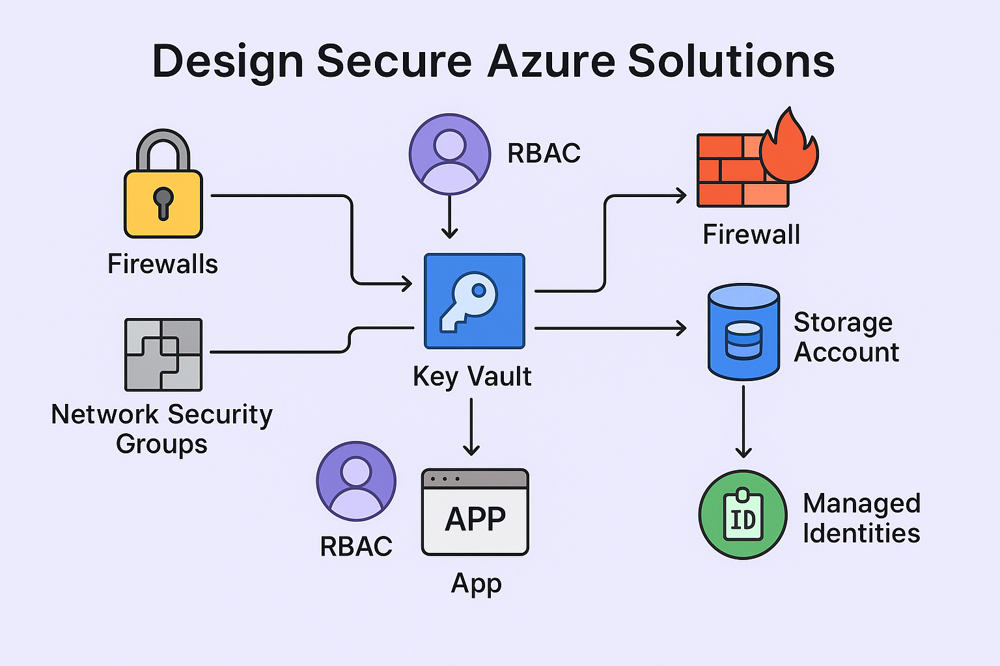
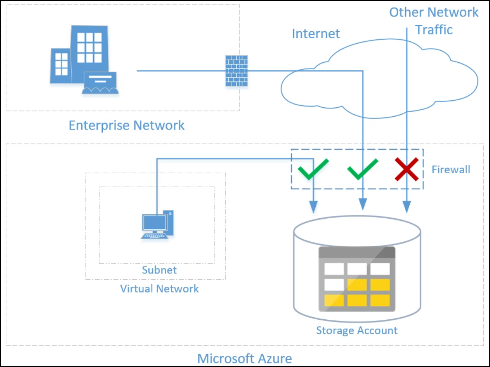
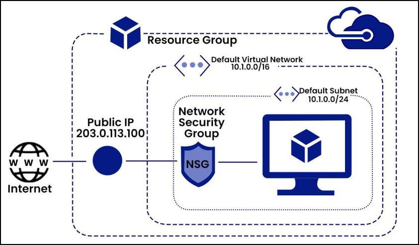
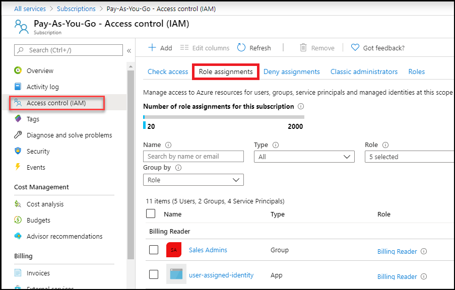
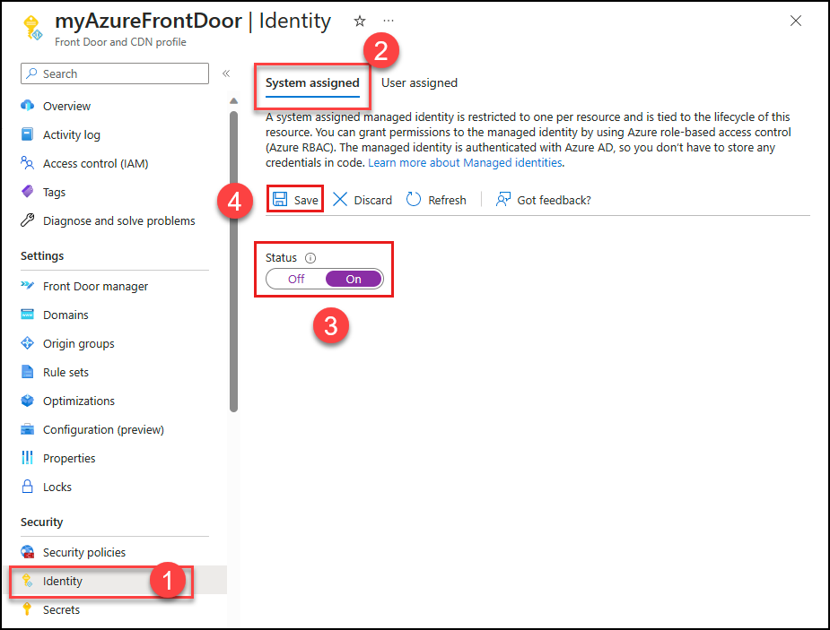
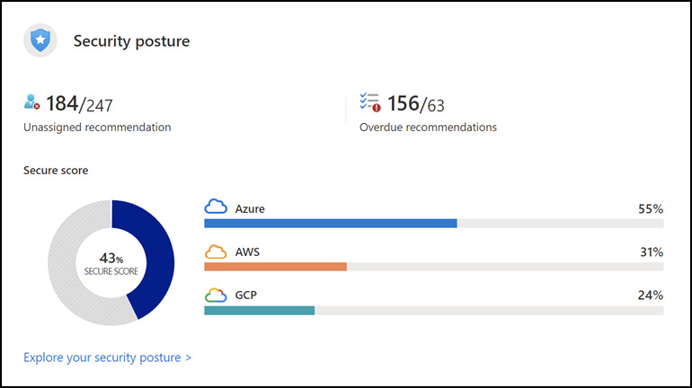

# 🔐 **Best Practices for Designing Secure Azure Solutions**

In today’s digital world, **security is no longer optional**—it’s the foundation of trust. Whether you're building a small web app or a mission-critical enterprise solution, **designing with security in mind from day one** ensures your Azure solutions remain resilient against evolving threats.

Microsoft Azure offers a comprehensive set of security features—but knowing when and how to use them effectively is key. This blog walks you through **core best practices** like firewalls, NSGs, RBAC, managed identities, and Microsoft’s built-in recommendations so that your cloud architecture stays secure, scalable, and compliant.

---

## 🧠 Security First: The Mindset

Think of Azure security like securing a building:
- You need **locks on doors** (firewalls),
- **Permission badges** for staff (RBAC),
- **Security zones** to limit movement (NSGs),
- And **trusted IDs** for apps and services (Managed Identities).

Now, let’s break each of these down.

---

## 🔥 1. Use Firewalls to Control Network Traffic

Azure resources like **Storage Accounts**, **Key Vaults**, and **SQL Databases** can be protected using built-in **firewalls**.

### Best Practices:
- **Restrict access by IP range** — Only allow trusted public IPs.
- **Deny public access by default** — Use private endpoints when possible.
- **Enable logging** to track access attempts.

🧪 ***Example:*** For Azure Storage, disable “Allow All Networks” and explicitly whitelist the backend subnet or developer workstation IPs.

---

## 🚦 2. Secure Subnets with Network Security Groups (NSGs)

**Network Security Groups (NSGs)** act like virtual firewalls at the subnet or NIC level. They control inbound and outbound traffic using security rules.

### Best Practices:
- Apply NSGs at both **subnet** and **network interface** level.
- Use **least privilege**—only open required ports (e.g., 443, 22).
- Monitor NSG rules regularly for unnecessary openings.

🔒 ***Example:*** Block all inbound traffic except port 443 for your App Gateway subnet.

---

## 👥 3. Apply Role-Based Access Control (RBAC)

**RBAC** helps you assign access based on roles instead of individual permissions.

### Best Practices:
- Use **Azure built-in roles** like Reader, Contributor, or Owner.
- **Avoid assigning at the subscription level**—use Resource Groups for scoped access.
- **Review access logs** regularly using Azure Activity Logs or Defender for Cloud.

👨‍💻 ***Example:*** Give your app developer team “Contributor” role only on the WebApp resource group—not the whole subscription.

---

## 🆔 4. Use Managed Identities for Secure App Access

Instead of storing secrets in code, **Managed Identities** allow Azure services to authenticate securely without credentials.

### Best Practices:
- Enable **System-Assigned Managed Identity** for each Azure service (App Services, Functions, VMs).
- Use it to authenticate to **Key Vault, Azure SQL, Storage**, etc.
- Avoid using hard-coded credentials or storing secrets in config files.

🔑 ***Example:*** An App Service accesses a Key Vault secret using its managed identity—no password needed, and it rotates automatically.

---

## 🛡️ 5. Follow Microsoft’s Security Recommendations

Azure provides security recommendations via:
- **Microsoft Defender for Cloud**
- **Azure Security Center**
- **Azure Advisor**

### Best Practices:
- Regularly check your **Secure Score** and act on recommendations.
- Enable **Just-In-Time VM access** to reduce attack surface.
- Use **Defender for Endpoint and Defender for Identity** for advanced protection.

📈 ***Example:*** If Security Center recommends enabling encryption at rest on a storage account—apply it immediately using the Azure Policy.

---

## 💡 Conclusion

Security in Azure isn’t just about setting passwords and checking boxes—it’s a continuous process of **designing smart**, **monitoring constantly**, and **applying least privilege principles**.

The good news? Azure makes this easier than ever with built-in tools and guidance.

So, whether you're developing your first Azure app or managing a production environment—**start secure, stay secure.** The cloud may be shared, but **your responsibility for protecting your resources is not.**

---

  
  

  
<strong>Ceekh Edunix Pvt Ltd</strong>
 
    Address: H-34, Ground Floor, Sector 63, Noida, Uttar Pradesh 
    Email: <a href="mailto:info@ceekh.com" style="color: #007bff;">info@ceekh.com</a>
  

  

© 2025 EduWe. All rights reserved.| Developed by Deepak Kumar Tyagi 

