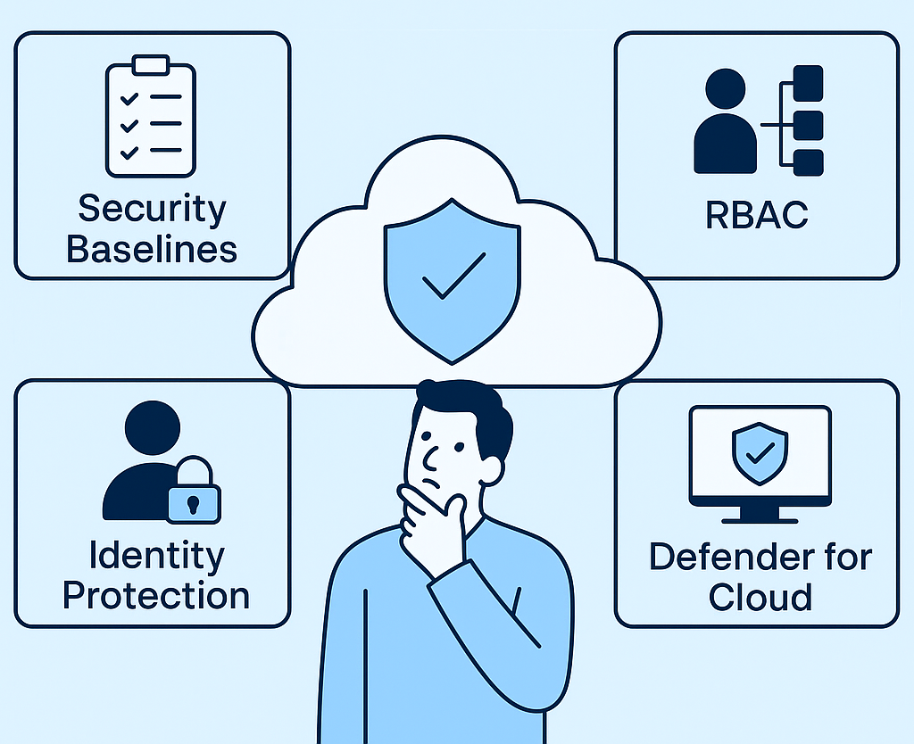
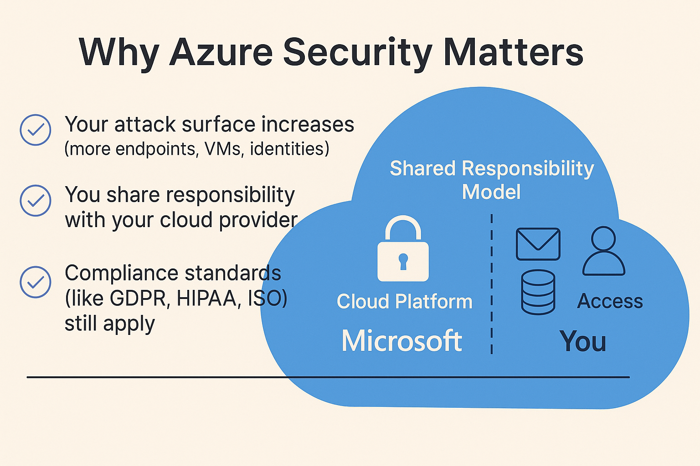
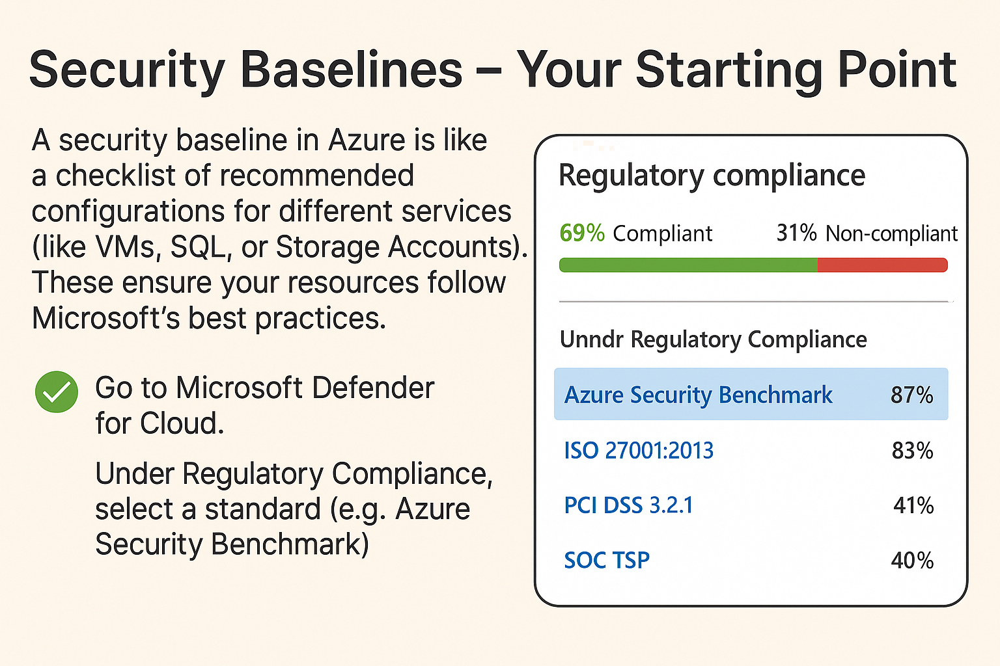
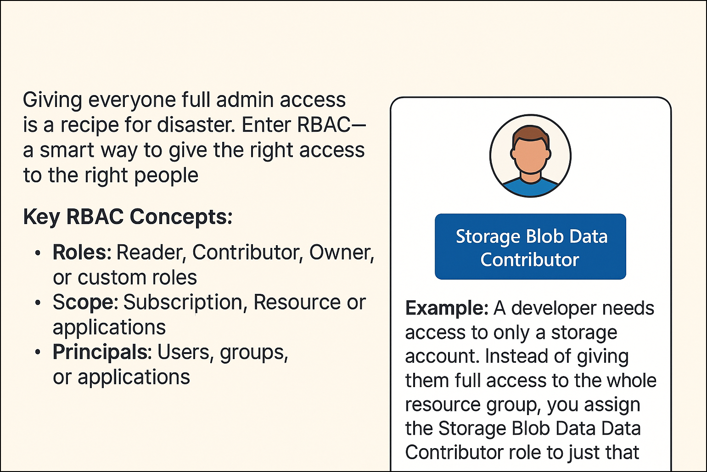
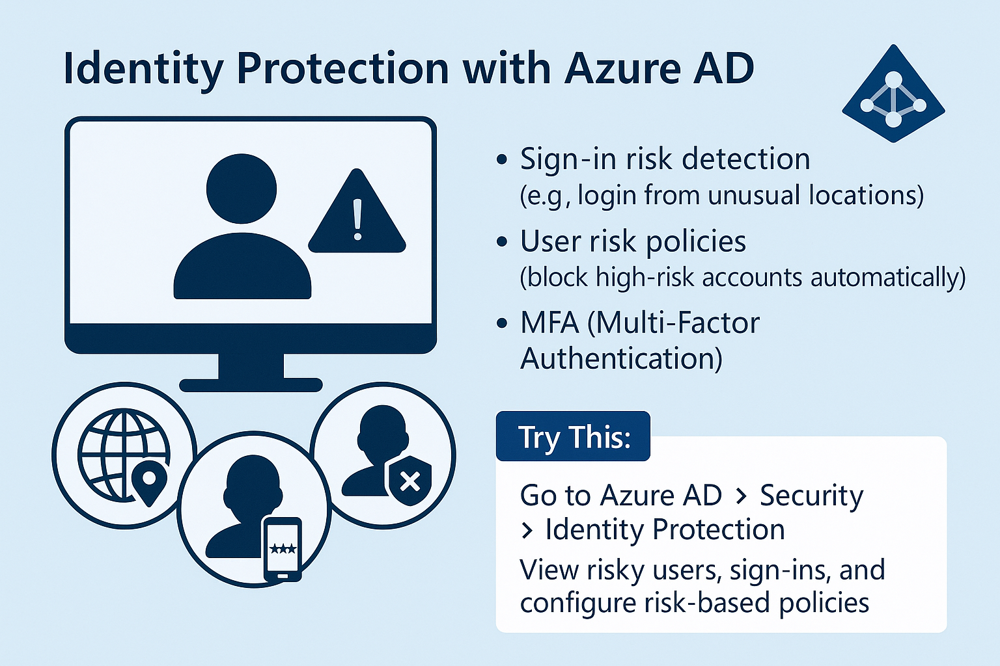
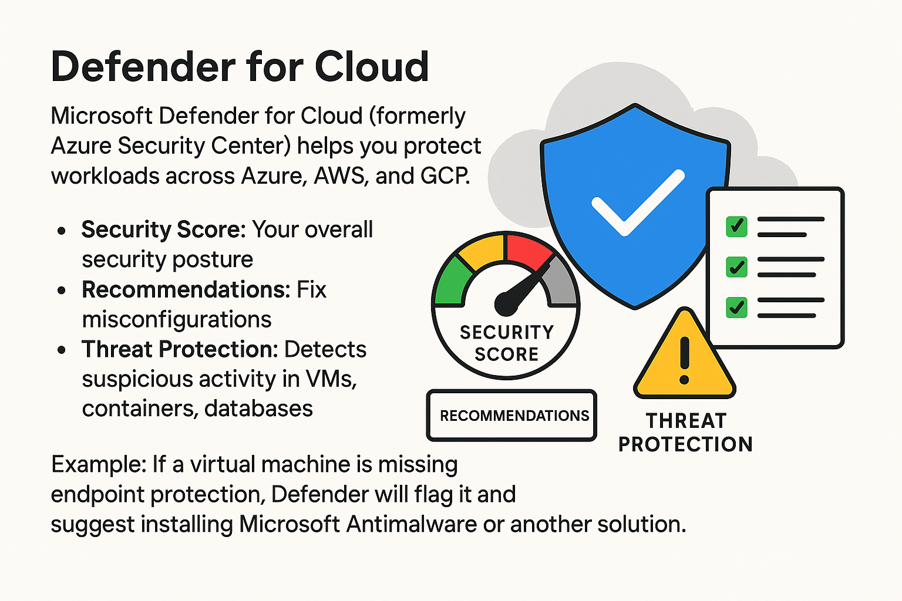
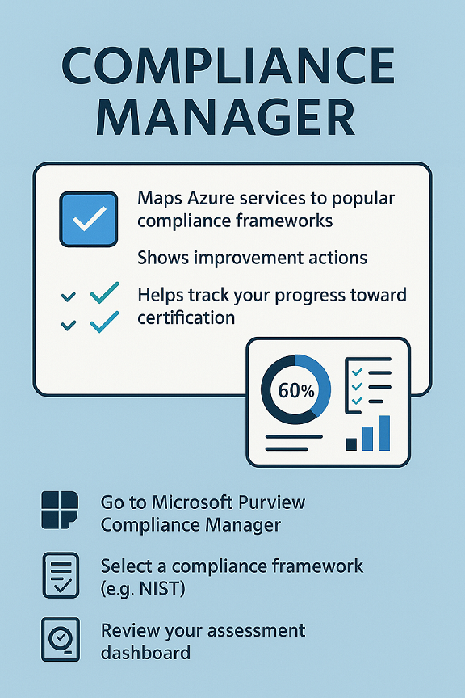
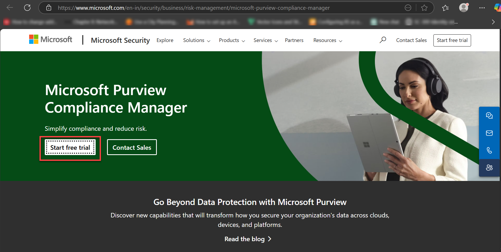

# 🛡️ **Introduction to Azure Security and Compliance**

<strong>[Building Trust, One Secure Cloud at a Time]</strong>

In today’s digital world, security and compliance are not optional—they're **essential**. Whether you're hosting a simple web app or managing sensitive business data in the cloud, protecting it is your top priority.

Microsoft Azure offers a robust set of **security and compliance tools** that make it easier for organizations and developers to build secure cloud environments. In this blog, we’ll take a hands-on look at key services like **Azure Security Center**, **Defender for Cloud**, **RBAC**, **Identity Protection**, and **Compliance Manager**.

Let’s walk through it step-by-step.

---

## 🔐 Step 1: Why Azure Security Matters

Before diving into tools, it’s important to understand **why cloud security matters**.

When you move to the cloud:

- Your **attack surface** increases (more endpoints, VMs, identities).
- You share responsibility with your cloud provider.
- Compliance standards (like GDPR, HIPAA, ISO) still apply.

Azure follows the **Shared Responsibility Model**:  
> Microsoft secures the **cloud platform**, and **you** secure what you put inside it—your apps, data, and access.

---

## 🛠️ Step 2: Security Baselines – Your Starting Point

A **security baseline** in Azure is like a checklist of recommended configurations for different services (like VMs, SQL, or Storage Accounts). These ensure your resources follow Microsoft’s best practices.

✅ To try it:

- Go to **Microsoft Defender for Cloud**.
- Under *Regulatory Compliance*, select a standard (e.g., Azure Security Benchmark).
- Azure will show you **which resources are compliant**, and where action is needed.

---

## 👥 Step 3: Role-Based Access Control (RBAC)

Giving everyone full admin access is a recipe for disaster. Enter **RBAC**—a smart way to **give the right access to the right people**.

🎯 Key RBAC Concepts:

- **Roles**: Reader, Contributor, Owner, or custom roles
- **Scope**: Subscription, Resource Group, or Resource level
- **Principals**: Users, groups, or applications

🔧 Example:

A developer needs access to only a storage account. Instead of giving them full access to the whole resource group, you assign the **Storage Blob Data Contributor** role to just that resource.

---

## 🧑‍💼 Step 4: Identity Protection with Azure AD

**Azure Active Directory (Azure AD)** is more than just a login system. It can detect and respond to **identity risks** in real time.

🚨 Features include:

- Sign-in risk detection (e.g., login from unusual locations)
- User risk policies (block high-risk accounts automatically)
- MFA (Multi-Factor Authentication)

🧪 Try This:

- Go to **Azure AD > Security > Identity Protection**
- View risky users, sign-ins, and configure risk-based policies

---

## 🛡️ Step 5: Defender for Cloud

**Microsoft Defender for Cloud** (formerly Azure Security Center) helps you protect workloads across Azure, AWS, and GCP.

📊 Features:

- **Security Score**: Your overall security posture
- **Recommendations**: Fix misconfigurations
- **Threat Protection**: Detects suspicious activity in VMs, containers, databases

💡 Example:

If a virtual machine is missing endpoint protection, Defender will flag it and suggest installing Microsoft Antimalware or another solution.

---

## ✅ Step 6: Compliance Manager

Worried about **GDPR**, **ISO 27001**, or **HIPAA**?

**Compliance Manager** simplifies the process:

- Maps Azure services to popular compliance frameworks
- Shows improvement actions
- Helps track your progress toward certification

🧭 Try this:

- Go to **Microsoft Purview Compliance Manager**
- Select a compliance framework (e.g., NIST)
- Review your assessment dashboard

---

## 💡 Conclusion:

Security isn’t a one-time job. It’s a continuous journey of:

- Reviewing policies  
- Managing identities  
- Monitoring resources  
- Responding to threats  
- Meeting compliance standards  

With tools like **RBAC**, **Defender for Cloud**, **Azure AD**, and **Compliance Manager**, Azure helps you not only stay secure—but prove it too.

---

## 🚀 Ready to Explore?

✅ Set up a **free Azure trial**  
✅ Create a **test resource group and VM**  
✅ Use **Defender for Cloud** to run a security assessment  
✅ Enable **MFA** and try out RBAC roles  

Learning by doing is the best way to master cloud security!

---

  
  

  
<strong>Ceekh Edunix Pvt Ltd</strong>
 
    Address: H-34, Ground Floor, Sector 63, Noida, Uttar Pradesh 
    Email: <a href="mailto:info@ceekh.com" style="color: #007bff;">info@ceekh.com</a>
  

  

© 2025 EduWe. All rights reserved.| Developed by Deepak Kumar Tyagi 

